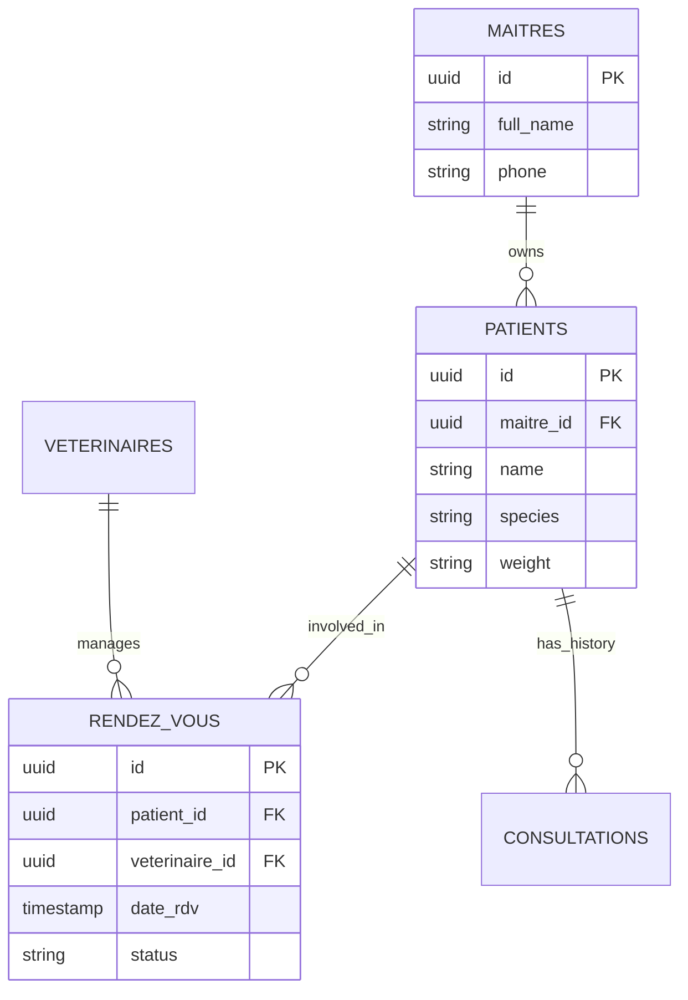
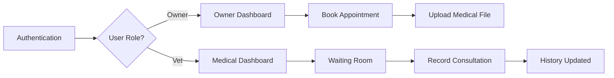
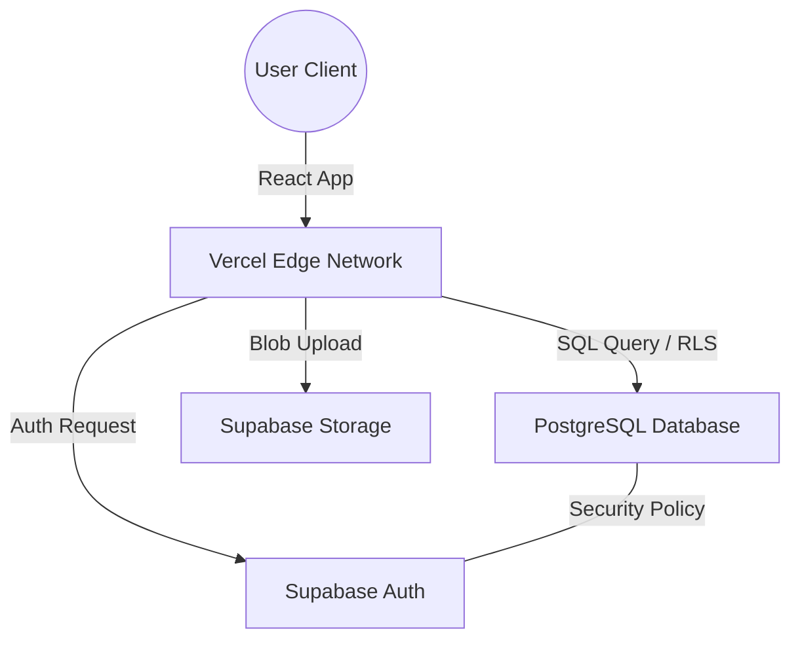

# VetoCare - Veterinary Management Platform
> Professional extranet for clinical management and patient tracking.

---

## Mission 4 : Architect Report

### 1. Theme Mapping
The VetoCare platform is a specialized management system for veterinary clinics. It facilitates the workflow between animal owners and medical professionals.

*   **Table A (Main Entity):** `public.maitres` (Animal owners / Users)
*   **Table B (Resource):** `public.veterinaires` (Veterinary doctors and specialists)
*   **Table C (Interaction):** `public.rendez_vous` (Appointment scheduling and clinical sessions)
*   **File (Storage):** `health-records` bucket (Storage for medical imaging, X-rays, and PDF records)

---

### 2. Architectural Diagrams

#### Entity Relationship Diagram (ERD)

#### Application User Flow

#### Cloud Infrastructure

---

### 3. Architecture Analysis

#### Financial Logic: Vercel + Supabase (OPEX vs CAPEX)
Launching VetoCare on a Vercel + Supabase stack is strategically superior to traditional hosting because it shifts the financial burden from **CAPEX** (Capital Expenditure) to **OPEX** (Operating Expenses). 

A traditional server setup requires significant CAPEX: purchasing physical hardware, servers, networking switches, and backup power units before the platform can go live. In contrast, our Cloud-Native stack requires zero upfront investment. By using Serverless technology, we only incur OPEX (operational costs) based on actual usage. This "Pay-as-you-go" model minimizes financial risk and allows the clinic to scale its budget in direct proportion to its growth, making it the most logical choice for a new project.

#### Scalability: Vercel vs Physical Data Centers
In a **local physical Data Center**, scalability is a manual and expensive process. Increasing capacity requires physically installing more server racks, upgrading **climatization** systems to manage increased heat output, and managing physical floor space. 

**Vercel** eliminates these constraints through automated **Serverless Scalability**. When traffic increases, Vercel dynamically allocates compute resources across its global infrastructure. There is no need for manual monitoring of hardware temperature or physical maintenance. The system scales instantly to thousands of concurrent users, providing a level of elasticity that is impossible to achieve with a local physical setup without massive over-provisioning of hardware.

#### Structured vs Unstructured Data
*   **Structured Data**: This represents the core relational data of our application, stored within the PostgreSQL database (Supabase). This includes patient names, appointment timestamps, and medical diagnosis codes. These data points follow a strict schema, ensuring integrity and allowing for complex relational queries.
*   **Unstructured Data**: This consists of the medical files and images uploaded by users (e.g., X-ray scans, PDF health records). These files do not have a predefined internal structure that a database can index directly. They are stored as binary objects (Blobs) in the **Storage Bucket**, with the application referencing them via unique URLs stored in the structured database.

---

## Deliverables & Submission Info

**Team Members:** [NAMES HERE]
**Theme:** VetoCare - Veterinary Clinic

- **Production URL:** [https://veto-care-2f5d.vercel.app/](https://veto-care-2f5d.vercel.app/)
- **GitHub Repository:** [https://github.com/estinaya2024/Veto-care](https://github.com/estinaya2024/Veto-care)

### Test Credentials
| Role | Email | Password |
| :--- | :--- | :--- |
| **Veterinary Doctor** | `doctor@vetocare.dz` | `password123` |
| **Pet Owner (Patient)** | `patient@vetocare.dz` | `password123` |

---
*Developed for the "Build & Ship" Module - 2026*
