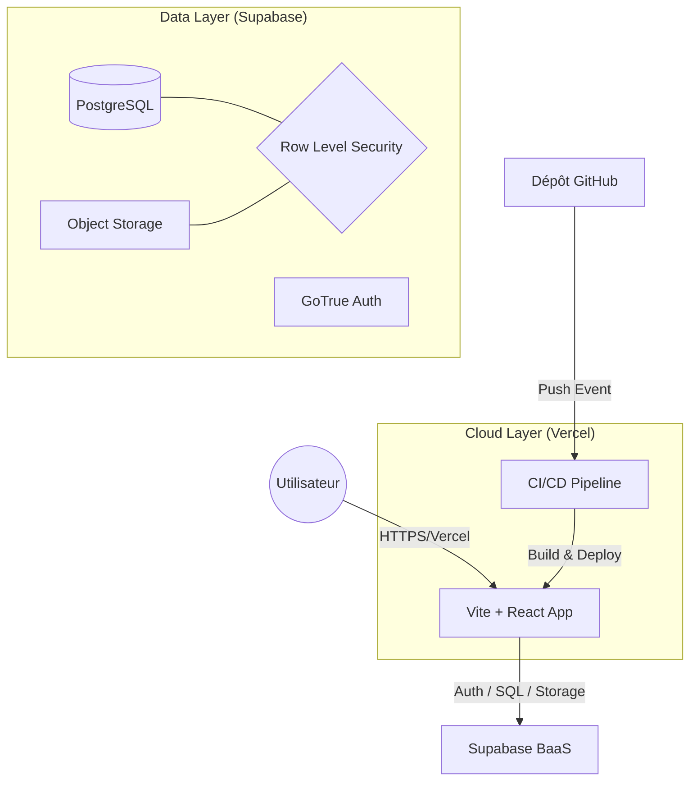
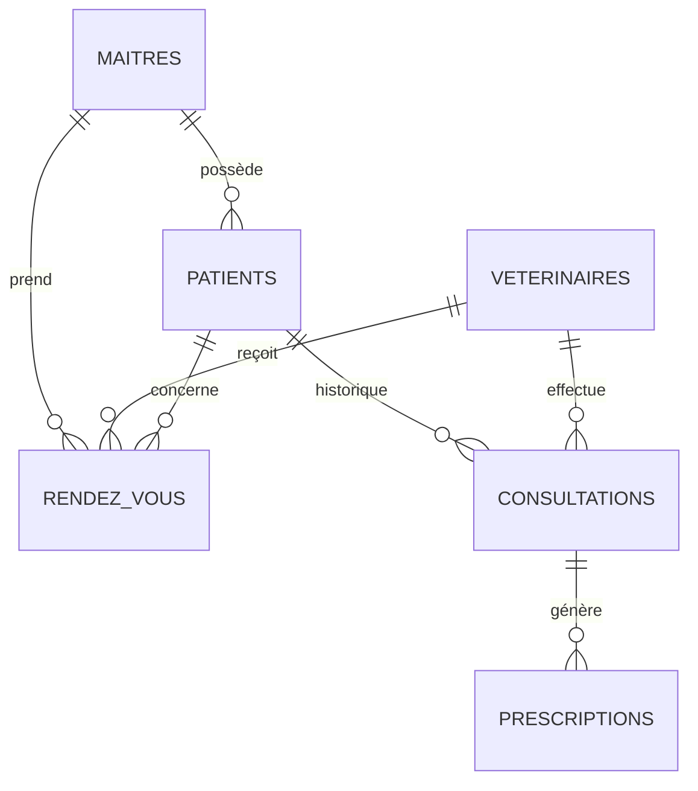

# Clinique Vétérinaire - Veto-Care 🐾

**Binôme :** [Prénom NOM 1] & [Prénom NOM 2]  
**Thème :** Clinique Vétérinaire ("Veto-Care")  
**Module :** Build & Ship - Architecture Cloud

---

## 🏗️ Architecture du Système

---

## 🛠️ Mission 4 : Le README "Architecte"

### 🎯 Mapping du Thème : Clinique Vétérinaire 🐾
Pour faciliter la correction, voici le mapping strict de nos entités :

| Concept Sujet | Entité Application | Table / Ressource |
| :--- | :--- | :--- |
| **Table A (Utilisateurs)** | Maîtres (Owners) | `public.maitres` (lié à `auth.users`) |
| **Table B (Ressources)** | Vétérinaires (Docs) | `public.veterinaires` |
| **Table C (Interactions)** | Rendez-vous (Agenda) | `public.rendez_vous` |
| **Storage (Fichiers)** | Carnet de santé | Bucket `health-records` |

### 🏛️ Analyse d'Architecture (Concepts Cloud)

#### 1. Justification Financière : CAPEX vs OPEX
Lancer **Veto-Care** avec un serveur classique (On-premise) nécessiterait un **CAPEX** (Capital Expenditure) massif : acquisition de serveurs physiques, mise en place d'un réseau sécurisé et frais d'installation. C'est un coût fixe risqué.
En choisissant **Vercel + Supabase**, nous adoptons un modèle **OPEX** (Operating Expenditure). Le coût est proportionnel à l'usage réel (Pay-as-you-go). Cela permet de démarrer avec un budget nul (Tier gratuit) tout en garantissant une infrastructure de classe entreprise dès le premier jour.

#### 2. Scalabilité Serverless vs Data Center Physique
Dans un **Data Center physique**, la scalabilité est limitée par le matériel disponible. Ajouter de la capacité est un processus lent et manuel.
**Vercel** utilise une architecture **Edge Computing** : notre code est déployé au plus proche de l'utilisateur. **Supabase** gère la base de données de manière élastique. Si le trafic augmente soudainement, l'infrastructure "Serverless" alloue automatiquement les ressources nécessaires sans intervention humaine, offrant une scalabilité horizontale instantanée.

#### 3. Données Structurées vs Non-structurées
- **Données Structurées** : Les profils, planning et dossiers médicaux sont stockés dans **PostgreSQL**. Ils suivent un schéma relationnel strict, permettant des jointures complexes et une intégrité référentielle totale.
- **Données Non-structurées** : Les scans de **Carnets de santé** (images, PDF) n'ont pas de schéma fixe. Ils sont stockés dans le **Supabase Storage** (Object Storage). Nous ne stockons dans la base de données que l'URL (métadonnée) pointant vers ces fichiers.

### 📊 Modèle de Données (ERD)

---

## 🚀 Accès & Test
- **URL de Production** : [https://votre-projet.vercel.app](https://votre-projet.vercel.app)
- **Identifiants de Test (Enseignant)** :
  - **Email** : `enseignant@vetocare.dz`
  - **Password** : `VetoTest2026!`
  - *Note : Cet utilisateur "Maître" a déjà un animal enregistré pour tester le flux.*

---

## 🛠️ Installation Locale
1. `npm install`
2. Configurer `.env` (Supabase URL & Key)
3. Exécuter `supabase_schema.sql` dans le SQL Editor de Supabase.
4. `npm run dev`
