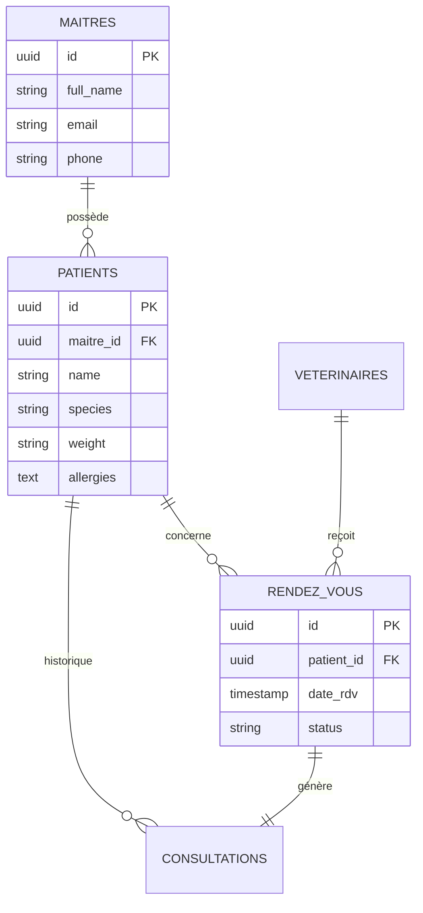
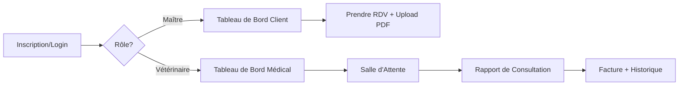
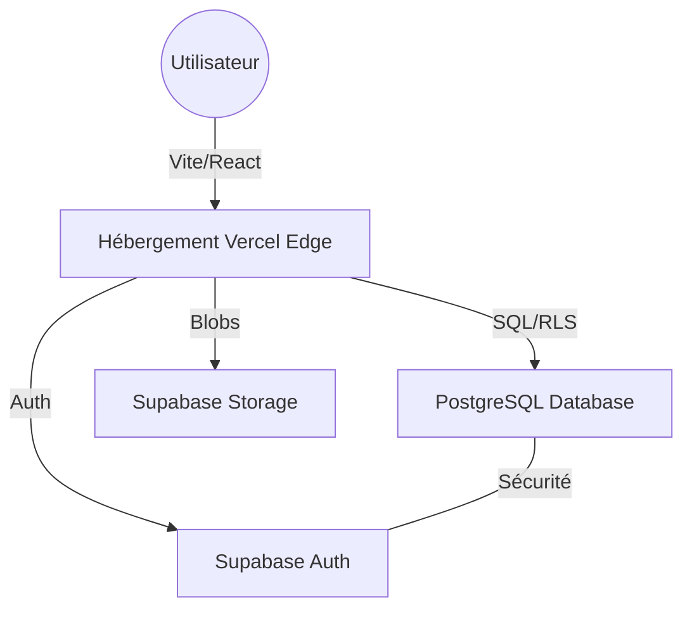

# 🐾 Veto-Care : Clinique Vétérinaire Cloud-Native
> **Extranet métier moderne construit avec la philosophie "Vibe Coding"**

**Lien de Production :** [https://veto-care-2f5d.vercel.app/](https://veto-care-2f5d.vercel.app/)

---

## 🎯 Mapping du Thème (Mission 1)

| Composant | Entité Métier | Table Supabase |
| :--- | :--- | :--- |
| **Table A (Utilisateurs)** | Maîtres d'animaux | `public.maitres` |
| **Table B (Ressources)** | Vétérinaires | `public.veterinaires` |
| **Table C (Interactions)** | Rendez-vous | `public.rendez_vous` |
| **Storage (Fichier)** | Carnet de santé | `health-records` bucket |

---

## 📐 Architecture & Modélisation

### 1. Modèle de Données (ERD)

### 2. Flux de l'Application (User Flow)

### 3. Architecture Cloud Serverless

---

## 🏗️ Analyse d'Architecture (Mission 4)

### 📈 Rentabilité : CAPEX vs OPEX
L'utilisation de **Vercel + Supabase** transforme l'investissement initial :
*   **CAPEX (0$)** : Aucun achat de matériel physique ou de serveurs.
*   **OPEX** : Coût opérationnel basé sur la consommation réelle. C'est le modèle "Pay-as-you-go", idéal pour une clinique agile.

### 🌐 Scalabilité et DevOps
*   **Auto-scaling** : Notre application gère 10 ou 1000 patients sans intervention humaine grâce aux fonctions Serverless.
*   **CI/CD** : Chaque `git push` déclenche un déploiement automatisé sur Vercel, garantissant une mise en production rapide et sécurisée.

### 💾 Données Structurées vs Non-structurées
*   **Structurées (PostgreSQL)** : Données tabulaires relationnelles (RDV, Diagnostics, Prix).
*   **Non-structurées (Storage)** : Fichiers binaires (PDF des carnets de santé, imagerie).

---

## ✨ Fonctionnalités Implémentées
- 🔐 **RLS (Row Level Security)** : Isolation totale des données. Un patient ne voit jamais les données d'un autre.
- 📅 **Agenda Dynamique** : Gestion des créneaux et des indisponibilités vétérinaires.
- 🏥 **Dossier Médical Partagé** : Historique complet des consultations et ordonnances.
- ⏳ **Check-in Temps Réel** : Système de salle d'attente automatisé.

---

## 🚀 Installation
1. `npm install`
2. `npm run dev`

**Identifiants de Test :**

| Rôle | Email | Mot de Passe |
| :--- | :--- | :--- |
| **Vétérinaire** | `doctor@vetocare.dz` | `password123` |
| **Patient** | `patient@vetocare.dz` | `password123` |

---
*Projet réalisé dans le cadre du module "Build & Ship" - 2026*
