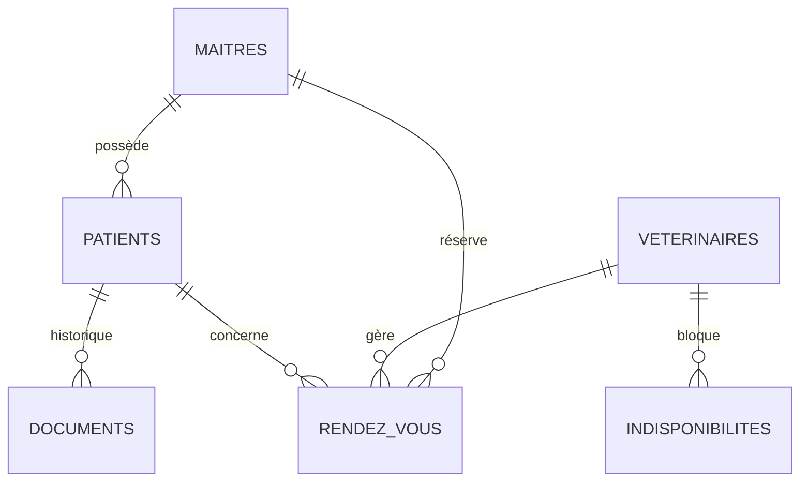

# Clinique Vétérinaire - Veto-Care 🐾

**Binôme :** Karoou aya malak & Bourenane Soundous & Boucherire Yasser  
**Thème :** Clinique Vétérinaire ("Veto-Care")  
**Module :** Build & Ship - Architecture Cloud

---

## ✨ Points Forts du Projet

- **Système Double Dashboard** : Interfaces distinctes et sécurisées pour les Vétérinaires (Gestion clinique) et les Propriétaires (Suivi & Réservation).
- **Architecture Cloud Native** : Déploiement sur **Vercel** (frontend) avec backend **Supabase** (PostgreSQL, Auth, Storage) et automation **n8n** pour l'IA.
- **Assistant IA n8n** : Agent conversationnel intelligent intégré propulsé par **n8n AI** — diagnostique les symptômes et guide l'utilisateur avec une expérience premium.
- **Multilingue Complet (i18n)** : Bascule instantanée Français ↔ Anglais ↔ Kabyle sur l'ensemble du site.
- **Sécurité RLS (Row Level Security)** : Isolation totale des données patients et accès granulaire pour le personnel médical.
- **UI Premium** : Design moderne avec Glassmorphism, animations fluides, et intégration soignée de l'assistant IA.
- **PWA Ready** : Application installable sur mobile et bureau.

---

## 🏗️ Architecture du Système


---

## 🛠️ Mapping Technique & Cloud

| Concept Sujet | Entité Application | Implémentation |
| :--- | :--- | :--- |
| **Profil Utilisateur** | Maîtres & Vets | `public.maitres` / `public.veterinaires` (Supabase) |
| **Gestion Médicale** | Patients & Dossiers | `public.patients` / `public.medical_documents` |
| **Agenda Temps Réel** | RDV & Absences | `public.rendez_vous` / `public.indisponibilites_vet` |
| **Fichiers Lourds** | Carnets de santé | Bucket `health-records` (S3 Supabase) |
| **Intelligence Artificielle** | Assistant n8n | n8n Agent + LangChain + Tools |
| **Internationalisation** | FR / EN / KAB | `I18nContext.tsx` — 120+ clés de traduction |

---

## 🤖 Assistant IA (n8n Agent)

L'assistant est accessible via le bouton flottant (logo patte de robot) en bas à droite.

**Capacités :**
1. **Pré-diagnostic Vétérinaire** : Évalue les symptômes et recommande des actions.
2. **Guide du Site** : Aide à la navigation et à l'utilisation des fonctionnalités.
3. **Workflow Automation** : Connecté directement aux flux n8n pour des réponses dynamiques.

**Stack :**
- Automation : **n8n.cloud**
- Frontend : `@n8n/chat` — Widget personnalisé avec Glassmorphism et logo VetoCare.
- UI : Overrides CSS premium pour une intégration parfaite.

---

## 🌐 Internationalisation (i18n)

La bascule de langue est disponible dans la **Navbar** (bouton FR / EN / KAB).

- **Fichier central** : `src/context/I18nContext.tsx`
- **Couverture** : Navbar, Hero, Services, Pourquoi nous choisir, Footer, Login, À Propos, Dashboard, Assistant IA
- **Ajout d'une nouvelle langue** : Ajouter un bloc dans l'objet `translations` de `I18nContext.tsx`.

---

## 📊 Modèle de Données (ERD)



---

### 🏛️ Analyse d'Architecture (Concepts Cloud)

#### 1. Justification Financière : CAPEX vs OPEX
Lancer **Veto-Care** avec un modèle **OPEX** (Vercel + Supabase) permet une réduction drastique du **CAPEX**. Pas d'investissement initial en serveurs. Le coût est indexé sur la croissance réelle de la clinique (Pay-as-you-go).

#### 2. Scalabilité & Disponibilité
L'utilisation de **Vercel Edge Functions** et de la scalabilité horizontale de **Supabase** garantit que la plateforme reste fluide même lors des pics de prises de rendez-vous (ex: campagnes de vaccination). L'IA est gérée par des webhooks n8n scalables.

#### 3. Sécurité & Intégrité
L'intégrité des données est gérée par **PostgreSQL** (Contraintes FK), tandis que la confidentialité est assurée par des **Politiques RLS** strictes : un propriétaire ne peut voir que ses propres animaux, tandis qu'un vétérinaire a une vue globale.

---

## 🚀 Accès & Test

- **URL de Production** : [https://veto-care-ten.vercel.app](https://veto-care-ten.vercel.app)

---

## 🛠️ Installation Locale

```bash
# 1. Installer les dépendances
npm install

# 2. Initialiser la base de données
# Exécuter unified_vetocare_schema.sql dans le SQL Editor de Supabase

# 3. Lancer le projet
npm run dev
```

---

## 📁 Structure du Projet

```
├── src/
│   ├── components/
│   │   ├── dashboard/        # BookingCalendar, OwnerDashboard, HealthRecord...
│   │   ├── layout/           # Navbar, Footer, Sidebar
│   │   └── sections/         # Hero, Services, WhyRelyOnUs
│   ├── context/
│   │   ├── AuthContext.ts
│   │   └── I18nContext.tsx   # Système i18n
│   └── pages/                # Login, About, Dashboard
└── unified_vetocare_schema.sql
```
