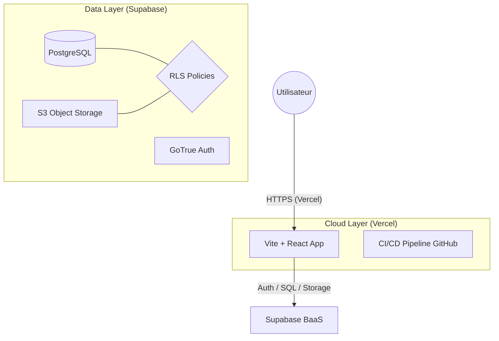
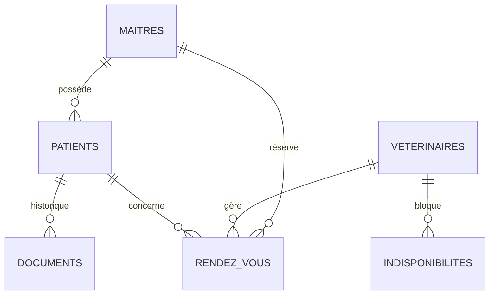

# Clinique Vétérinaire - Veto-Care 🐾

**Binôme :** Karoou aya malak & Bourenane Soundous & Boucherire Yasser  
**Thème :** Clinique Vétérinaire ("Veto-Care")  
**Module :** Build & Ship - Architecture Cloud

---

## ✨ Points Forts du Projet
- **Système Double Dashboard** : Interfaces distinctes et sécurisées pour les Vétérinaires (Gestion clinique) et les Propriétaires (Suivi & Réservation).
- **Architecture Serverless** : Déploiement sur **Vercel** avec backend **Supabase** (PostgreSQL, Auth, Storage).
- **Multilingue Natif** : Support complet du Français et de l'Anglais.
- **Sécurité RLS (Row Level Security)** : Isolation totale des données patients et accès granulaire pour le personnel médical.
- **UI Premium** : Design moderne avec Glassmorphism, micro-animations (Framer Motion) et expérience utilisateur fluide.

---

## 🏗️ Architecture du Système

---

## 🛠️ Mapping Technique & Cloud

| Concept Sujet | Entité Application | Implémentation Supabase |
| :--- | :--- | :--- |
| **Profil Utilisateur** | Maîtres & Vets | `public.maitres` / `public.veterinaires` |
| **Gestion Médicale** | Patients & Dossiers | `public.patients` / `public.medical_documents` |
| **Agenda Temps Réel** | RDV & Absences | `public.rendez_vous` / `public.indisponibilites_vet` |
| **Fichiers Lourds** | Carnets de santé | Bucket `health-records` (S3) |

---

### 🏛️ Analyse d'Architecture (Concepts Cloud)

#### 1. Justification Financière : CAPEX vs OPEX
Lancer **Veto-Care** avec un modèle **OPEX** (Vercel + Supabase) permet une réduction drastique du **CAPEX**. Pas d'investissement initial en serveurs. Le coût est indexé sur la croissance réelle de la clinique (Pay-as-you-go).

#### 2. Scalabilité & Disponibilité
L'utilisation de **Vercel Edge Functions** et de la scalabilité horizontale de **Supabase** garantit que la plateforme reste fluide même lors des pics de prises de rendez-vous (ex: campagnes de vaccination).

#### 3. Sécurité & Intégrité
L'intégrité des données est gérée par **PostgreSQL** (Contraintes FK), tandis que la confidentialité est assurée par des **Politiques RLS** strictes : un propriétaire ne peut voir que ses propres animaux, tandis qu'un vétérinaire a une vue globale.

---

## 📊 Modèle de Données (ERD)

---

## 🚀 Accès & Test
- **URL de Production** : [https://veto-care-ten.vercel.app](https://veto-care-murex.vercel.app/)
- **Comptes de Test** :
  - **Vétérinaire** : `veto@vetocare.com` / `veto123`
  - **Propriétaire** : `owner@vetocare.com` / `owner123`

---

## 🛠️ Installation Locale
1. `npm install`
2. Configurer `.env` avec vos clés Supabase.
3. **Important** : Exécuter le script `final_supabase_setup.sql` dans le SQL Editor de Supabase pour initialiser toute la structure, les fonctions RPC et les politiques de sécurité.
4. `npm run dev`

