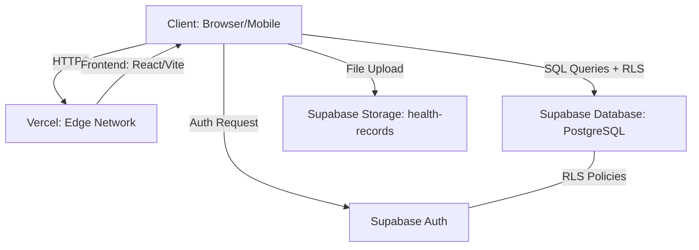
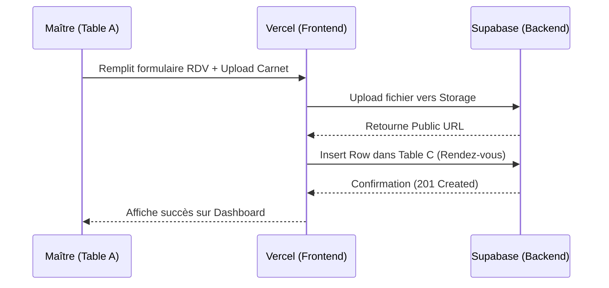

# 🐾 Veto-Care : Clinique Vétérinaire Cloud-Native
> **Extranet métier moderne construit avec la philosophie "Vibe Coding"**

**Lien de Production :** [https://veto-care-2f5d.vercel.app/](https://veto-care-2f5d.vercel.app/)

---

## 🎯 Mapping du Thème (Mission 1)

| Composant | Entité Métier | Table Supabase |
| :--- | :--- | :--- |
| **Table A (Utilisateurs)** | Maîtres d'animaux | `public.maitres` |
| **Table B (Ressources)** | Vétérinaires | `public.veterinaires` |
| **Table C (Interactions)** | Rendez-vous | `public.rendez_vous` |
| **Storage (Fichier)** | Carnet de santé | `health-records` bucket |

---

## 📐 Schémas Techniques

### 1. Architecture Cloud (Serverless)

### 2. Logique de Prise de Rendez-vous

---

---

## ✨ Fonctionnalités Clés
- 🔐 **Authentification Multi-Rôle** : Espaces dédiés pour Maîtres et Docteurs.
- 📅 **Calendrier Interactif** : Prise de RDV en temps réel avec gestion des indisponibilités.
- 🏥 **Dossier de Santé** : Suivi médical (poids, allergies, vaccins) et imagerie.
- ⏳ **Salle d'Attente** : Système de check-in dynamique pour la clinique.
- 📂 **Coffre-fort Médical** : Upload et consultation sécurisée des carnets de santé.

---

## 🏗️ Analyse d'Architecture (Mission 4)

### 📈 Rentabilité : CAPEX vs OPEX
L'utilisation de **Vercel + Supabase** transforme l'investissement initial :
*   **CAPEX (0$)** : Aucun achat de matériel physique ou de licences logicielles coûteuses.
*   **OPEX** : Coût opérationnel basé sur la consommation réelle. C'est le modèle idéal pour une startup vétérinaire qui souhaite monter en charge sans risque financier massif.

### 🌐 Scalabilité Serverless
Contrairement à un serveur classique limité par ses ressources physiques, notre architecture est **élastique** :
*   **Auto-scaling** : Les fonctions API et le frontend s'adaptent instantanément au nombre de patients connectés.
*   **Zéro Maintenance** : Pas de gestion de climatisation, de racks ou de sécurité physique du Data Center ; tout est géré par les fournisseurs Cloud.

### 💾 Données Structurées vs Non-structurées
*   **Structurées (PostgreSQL)** : Toutes les données tabulaires (noms, dates de RDV, diagnostics).
*   **Non-structurées (Storage)** : Fichiers binaires tels que les scans de carnets de santé et les clichés d'imagerie médicale.

---

## 🚀 Installation & Test
1. **Clonez le dépôt** : `git clone`
2. **Installation** : `npm install`
3. **Lancement** : `npm run dev`

**Identifiants de Test :**
*   **Email** : `test@example.com`
*   **MDP** : `password123`

---
*Projet réalisé dans le cadre du module "Build & Ship" - 2026*
