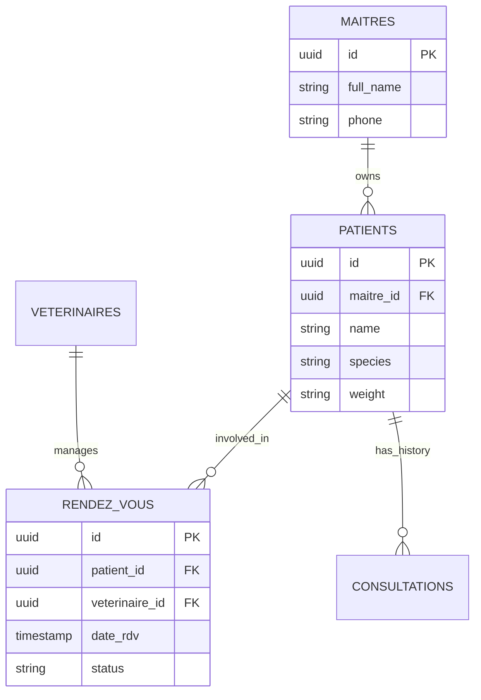
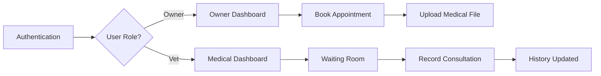
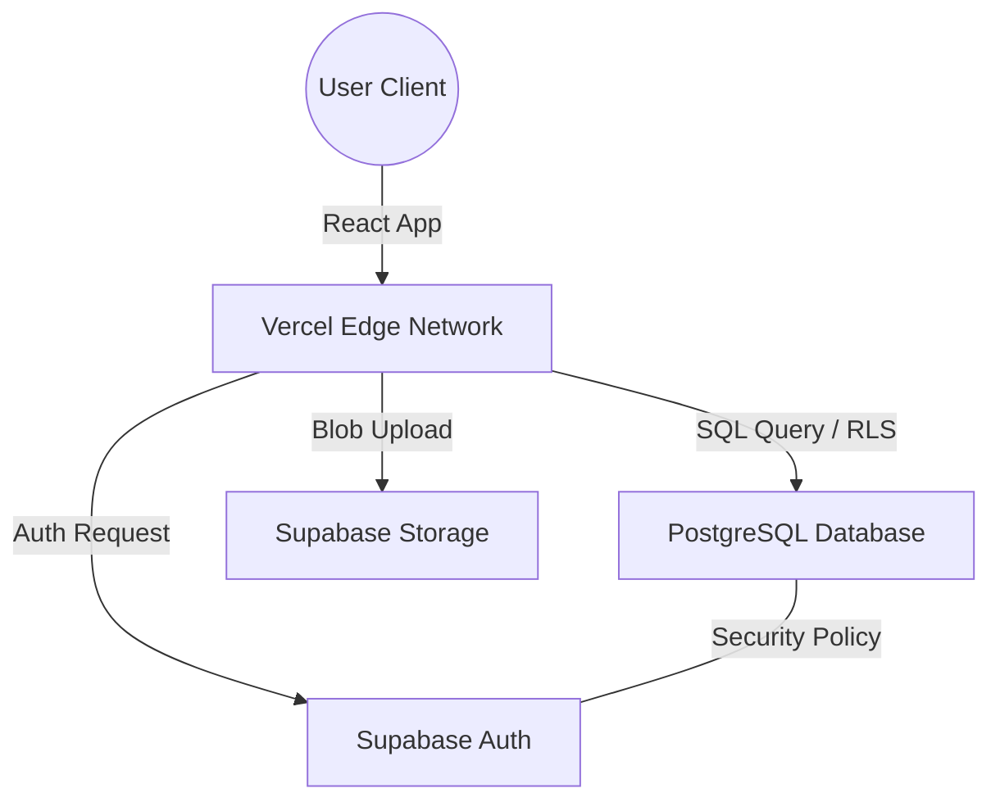

# VetoCare - Veterinary Management Platform
> Professional extranet for clinical management and patient tracking.

---

## Mission 4 : Architect Report

---

### 1. Theme Mapping
The VetoCare platform is a specialized management system for veterinary clinics. It facilitates the workflow between animal owners and medical professionals.

| Component | Entity | Role in System |
| :--- | :--- | :--- |
| **Table A** | `public.maitres` | Main Entity: Animal owners and system users. |
| **Table B** | `public.veterinaires` | Resource: Veterinary doctors and specialists. |
| **Table C** | `public.rendez_vous` | Interaction: Appointment scheduling and clinical history. |
| **File** | `health-records` | Storage: Medical imaging, X-rays, and PDF records. |

---

### 2. Architectural Diagrams

#### Entity Relationship Diagram (ERD)

---

#### Application User Flow

---

#### Cloud Infrastructure

---

### 3. Architecture Analysis

#### Financial Logic: Vercel + Supabase (OPEX vs CAPEX)
Launching VetoCare on a Vercel + Supabase stack is strategically superior to traditional hosting because it shifts the financial burden from capital investment to operational agility.

| Concept | Traditional Server | Vercel + Supabase |
| :--- | :--- | :--- |
| **Investment Type** | **CAPEX** (Large upfront costs) | **OPEX** (Pay-as-you-go) |
| **Hardware** | Purchasing physical servers/racks. | Zero hardware ownership. |
| **Risk** | High risk if the project fails. | Minimal risk; cost scales with usage. |

A traditional setup requires significant CAPEX before writing code. In contrast, our Cloud-Native stack requires zero upfront investment. The "Pay-as-you-go" model minimizes financial risk and allows the clinic to scale its budget in direct proportion to its growth.

---

#### Gestion de la Scalabilité (Vercel vs Data Center Physique)
In a local physical Data Center, scalability is a manual and expensive process.

*   **Physical Constraints**: Increasing capacity requires adding more server racks and upgrading **climatization** systems to manage increased heat output.
*   **Vercel Solution**: **Vercel** eliminates these constraints through automated **Serverless Scalability**. When traffic increases, Vercel dynamically allocates compute resources across its global infrastructure. There is no need for manual monitoring of hardware temperature or physical maintenance. The system scales instantly, providing elasticity impossible to achieve with a local physical setup.

---

#### Donnée Structurée vs Donnée Non-structurée
Our application manages two distinct types of data to provide a full clinical experience.

| Data Type | Example in VetoCare | Storage Method |
| :--- | :--- | :--- |
| **Structured** | Names, Dates, Diagnosis Codes. | PostgreSQL Relational Tables. |
| **Unstructured** | X-Ray Images, PDF Scans, Photos. | Supabase Storage Buckets (Blobs). |

*   **Structured Data**: Represents the core relational data. It follows a strict schema, ensuring integrity and allowing for complex relational queries.
*   **Unstructured Data**: Consists of files that do not have a predefined internal structure. They are stored as objects, with the application referencing them via unique URLs stored in the structured database.

---

## Deliverables & Submission Info

| Field | Detail |
| :--- | :--- |
| **Team Members** | [NAMES HERE] |
| **Theme** | VetoCare - Veterinary Clinic |
| **Production URL** | [https://veto-care-2f5d.vercel.app/](https://veto-care-2f5d.vercel.app/) |
| **GitHub Repository** | [https://github.com/estinaya2024/Veto-care](https://github.com/estinaya2024/Veto-care) |

---

### Test Credentials
| Role | Email | Password |
| :--- | :--- | :--- |
| **Veterinary Doctor** | `doctor@vetocare.dz` | `password123` |
| **Pet Owner (Patient)** | `patient@vetocare.dz` | `password123` |

---
*Developed for the Build & Ship Module - 2026*
