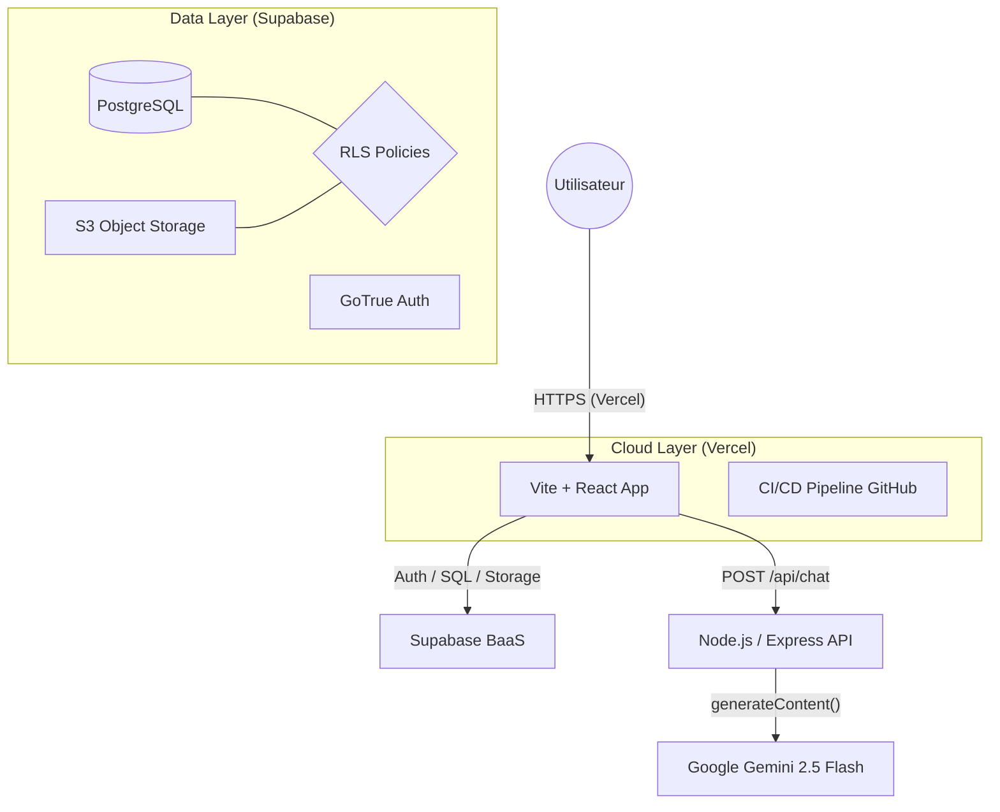
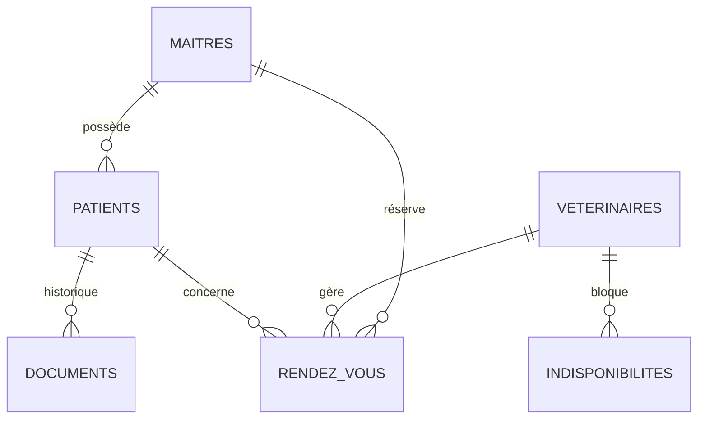

# Clinique Vétérinaire - Veto-Care 🐾

**Binôme :** Karoou aya malak & Bourenane Soundous & Boucherire Yasser  
**Thème :** Clinique Vétérinaire ("Veto-Care")  
**Module :** Build & Ship - Architecture Cloud

---

## ✨ Points Forts du Projet

- **Système Double Dashboard** : Interfaces distinctes et sécurisées pour les Vétérinaires (Gestion clinique) et les Propriétaires (Suivi & Réservation).
- **Architecture Serverless** : Déploiement sur **Vercel** (frontend) avec backend **Supabase** (PostgreSQL, Auth, Storage) et serveur **Node.js/Express** pour l'IA.
- **Assistant IA Gemini** : Agent conversationnel intégré propulsé par **Google Gemini 2.5 Flash** — diagnostique les symptômes et guide l'utilisateur à travers le site.
- **Multilingue Complet (i18n)** : Bascule instantanée Français ↔ Anglais sur l'ensemble du site via un contexte React dédié (`I18nContext`).
- **Sécurité RLS (Row Level Security)** : Isolation totale des données patients et accès granulaire pour le personnel médical.
- **UI Premium** : Design moderne sans dégradé, animations Framer Motion, logo IA généré par Imagen avec fond transparent.
- **PWA Ready** : Application installable sur mobile et bureau.

---

## 🏗️ Architecture du Système



---

## 🛠️ Mapping Technique & Cloud

| Concept Sujet | Entité Application | Implémentation |
| :--- | :--- | :--- |
| **Profil Utilisateur** | Maîtres & Vets | `public.maitres` / `public.veterinaires` (Supabase) |
| **Gestion Médicale** | Patients & Dossiers | `public.patients` / `public.medical_documents` |
| **Agenda Temps Réel** | RDV & Absences | `public.rendez_vous` / `public.indisponibilites_vet` |
| **Fichiers Lourds** | Carnets de santé | Bucket `health-records` (S3 Supabase) |
| **Intelligence Artificielle** | Symptômes & Navigation | Google Gemini 2.5 Flash via `@google/generative-ai` |
| **Internationalisation** | FR / EN | `I18nContext.tsx` — 120+ clés de traduction |

---

## 🤖 Assistant IA (Gemini)

L'assistant est accessible via le bouton flottant (logo patte de robot) en bas à droite de chaque page.

**Capacités :**
1. **Pré-diagnostic Vétérinaire** : Évalue les symptômes décrits et recommande une consultation.
2. **Guide du Site** : Explique comment créer un compte, ajouter un animal, réserver via le calendrier.

**Stack :**
- Backend : `server/index.js` — Node.js + Express + `@google/generative-ai`
- Frontend : `AISymptomChecker.tsx` — Widget chat React avec logo IA généré par Imagen (fond supprimé via Python/Pillow)
- Modèle : `gemini-2.5-flash`

> ⚠️ La clé API `GEMINI_API_KEY` doit être configurée dans les variables d'environnement du service backend hébergé (Render/Railway).

---

## 🌐 Internationalisation (i18n)

La bascule de langue est disponible dans la **Navbar** (bouton FR / EN).

- **Fichier central** : `src/context/I18nContext.tsx`
- **Couverture** : Navbar, Hero, Services, Pourquoi nous choisir, Footer, Login, À Propos, Dashboard, Assistant IA
- **Ajout d'une nouvelle langue** : Ajouter un bloc dans l'objet `translations` de `I18nContext.tsx`.

---

## 📊 Modèle de Données (ERD)



---

### 🏛️ Analyse d'Architecture (Concepts Cloud)

#### 1. Justification Financière : CAPEX vs OPEX
Lancer **Veto-Care** avec un modèle **OPEX** (Vercel + Supabase) permet une réduction drastique du **CAPEX**. Pas d'investissement initial en serveurs. Le coût est indexé sur la croissance réelle de la clinique (Pay-as-you-go).

#### 2. Scalabilité & Disponibilité
L'utilisation de **Vercel Edge Functions** et de la scalabilité horizontale de **Supabase** garantit que la plateforme reste fluide même lors des pics de prises de rendez-vous (ex: campagnes de vaccination). L'API IA est isolée dans un microservice Node.js indépendant.

#### 3. Sécurité & Intégrité
L'intégrité des données est gérée par **PostgreSQL** (Contraintes FK), tandis que la confidentialité est assurée par des **Politiques RLS** strictes : un propriétaire ne peut voir que ses propres animaux, tandis qu'un vétérinaire a une vue globale. La clé Gemini n'est jamais exposée au client.

---

## 🚀 Accès & Test

- **URL de Production** : [https://veto-care-ten.vercel.app](https://veto-care-murex.vercel.app/)
- **Comptes de Test** :

---

## 🛠️ Installation Locale

```bash
# 1. Installer les dépendances frontend
npm install

# 2. Installer les dépendances backend
cd server && npm install && cd ..

# 3. Configurer les variables d'environnement
# Créer un fichier .env à la racine avec vos clés Supabase
# Créer un fichier server/.env avec votre clé Gemini :
#   GEMINI_API_KEY=your_key_here
#   PORT=5001

# 4. Initialiser la base de données
# Exécuter unified_vetocare_schema.sql dans le SQL Editor de Supabase

# 5. Lancer le projet (frontend + backend en parallèle)
npm run dev:all
```

---

## 📁 Structure du Projet

```
├── src/
│   ├── components/
│   │   ├── dashboard/        # AISymptomChecker, BookingCalendar, OwnerDashboard...
│   │   ├── layout/           # Navbar, Footer, Sidebar
│   │   └── sections/         # Hero, Services, WhyRelyOnUs
│   ├── context/
│   │   ├── AuthContext.ts
│   │   └── I18nContext.tsx   # Système i18n FR/EN
│   └── pages/                # Login, About, Dashboard
├── server/
│   ├── index.js              # API Express + Gemini AI
│   └── .env                  # GEMINI_API_KEY (non versionné)
└── unified_vetocare_schema.sql
```
